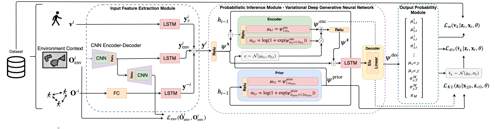

# Social-VRNN: One-Shot Multi-modal Trajectory Prediction for Interacting Pedestrians


This is the code associated with the following publications:

**Conference Version:** "Social-VRNN: One-Shot Multi-modal Trajectory Prediction for Interacting Pedestrians", submitted to. [Link to Paper](-), [Link to Video](https://www.youtube.com/watch?v=XHoXkWLhwYQ)

This repository also contains the scripts to train and evaluate quantitatively and qualitatively the proposed network architecture.

---

### Setup

This set of instructions were only tested for Ubuntu16 with Tensorflow 1.15.
* Please follow the following instructions:
```
./install.sh
./download_data
source social_vrnn/bin/activate
```
* To test the models:
```
cd src/
./test.sh
```
* To train the models:
```
cd src/
./train.sh
```
* To run comparison with Social-ways model:
```
cd src/
./test_socialways.sh
```
The train.sh script has several examples how to train the proposed model for different datasets and considering different hyperparameters. After the model is trained, the test.sh script evaluates the quatitative and qualitative performance of the trained models. Each model has a name and an id (`--exp_num`) which identifies it.
To evaluate the trained models, adapt accordingly the id's and model name on the `test.sh` script. For a qualitative analysis set `--record true`. For a quantitative analysis set `--record false`.

You can find the trained_models folder, all the trained models and inside each model the qualitative results in a video format. The quantitative results are saved inside the `src` src folder on a csv file with the model name, e.g. `<Model name>.csv`.  
### Model

<div align='center'>
</img>
</div>

### Code Description
The code is structure as it follows:
- Training script: `train.py`
- Testing script: `test.py`
- Comparison with Social-ways: `test_socialways.py`
- Model Architectures:
    - VRNN cell model: `vrnn_cell.py`
    - Social-VRNN model: `SocialVRNN.py`
    - Deterministic baseline: `RNN.py` 
    - STORN baseline: `STORN.py` 

Please note models were trained using the original implementation of [Social-Ways](https://github.com/amiryanj/socialways.git). The performance results presented for a smaller number of samples were obtained using the test function provided in this repository. The qualitative compariison results use the same inference scheme as provided in the original repo. Here we just provide the plot functions to visualize the predictions of the Social-Ways model.

### Ackowledgements:

We would like to thanks Mark Pfeiffer who provided the implementation from which this code was built on: "A data-driven model for interaction-aware pedestrian motion prediction in object cluttered environments" [Link to Paper](https://arxiv.org/pdf/1709.08528.pdf).

### If you find this code useful, please consider citing:

```
@inproceedings{,
  author = {},
  booktitle = {Conference on Robot Learning},
  date-modified = {2020-07-18 06:18:08 -0400},
  month = July,
  title = {Social-VRNN: One-Shot Multi-modal Trajectory Prediction for Interacting Pedestrians},
  year = {2020},
  url = {-},
  bdsk-url-1 = {-}
}
```